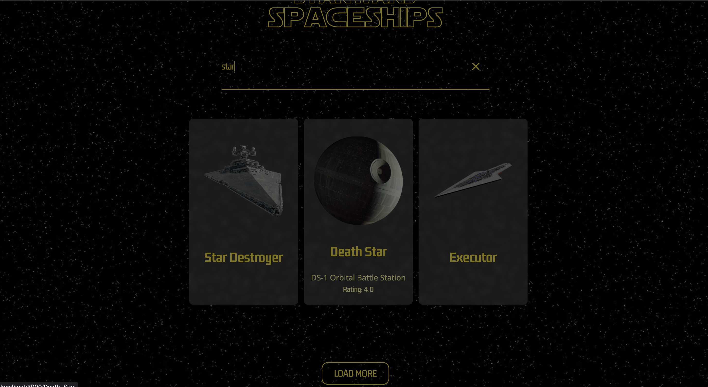

# StarWars Starships React App

This is a React.js app that displays and searches starships data from the Star Wars API. The app is built using React.js, Tailwind CSS, Axios, and Router. The app lists the starships and displays their names, models, and hyperdrive ratings. Users can search for starships based on their names or models using a single input field. Users can click on a starship item to see its details, including passengers, maximum atmospheric speed, manufacturer, crew, and cargo capacity, in addition to the name and model. Users can also go back to the home page from the detail page.

## Technologies

- React.js
- Tailwind CSS
- Axios
- React Router

## Features

- List all starships available in the Star Wars API
- Search for a starship by name or model
- Display the name, model, and hyperdrive rating of each starship in the list
- Display the details of a specific starship, including passengers, max atmosphering speed, manufacturer, crew, and cargo capacity
- Load more starships with a load more button
- Navigate between the homepage and the detail page using the router

## Getting Started

To get started with the application, clone the repository to your local machine using the following command:

```bash
git clone https://github.com/your-username/starwars-starships.git
```

After cloning the repository, navigate to the project's root directory and install the project's dependencies by running the following command:

```bash
npm install
```

## Dependencies

The application requires the following dependencies:

```
"dependencies": {
    "@testing-library/jest-dom": "^5.16.5",
    "@testing-library/react": "^13.4.0",
    "@testing-library/user-event": "^13.5.0",
    "axios": "^1.3.5",
    "react": "^18.2.0",
    "react-dom": "^18.2.0",
    "react-router-dom": "^6.10.0",
    "react-scripts": "^5.0.1",
    "slugify": "^1.6.6",
    "web-vitals": "^2.1.4"
  }
```

## Usage

To start the application, navigate to the project's root directory and run the following command:

```bash
npm start
```

The application will start running at http://localhost:3000.

---





